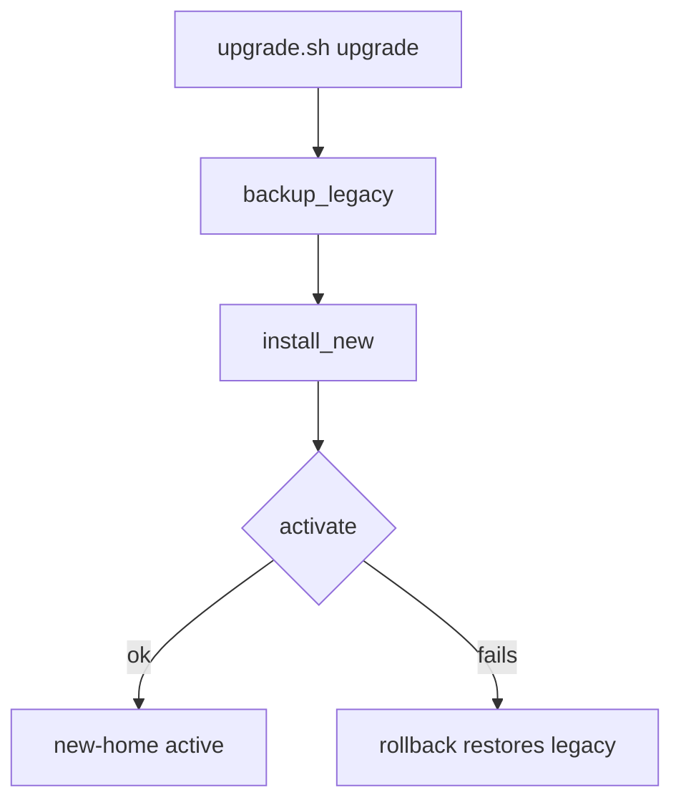

<!-- markdownlint-disable-next-line MD025 -->
# Move the memory engine to new-home with rollback

## TL;DR

- Effort: S — one script and one check.
- Risk: medium — rollback touches the owner's installation.
- Decisions made: keep POSIX `sh`; no new dependency.
- Owner decisions pending: none.
- Cut from scope: changing the bank format.
- Branch: `feat/memory-new-home` — no branches to sample; type/slug default.

## Scope

### Affected users

The owner, whose session hook, shell helper, and tool registration call the memory engine.

### Ideal state

`sh upgrade.sh upgrade` moves the engine to `new-home/`. If activation fails, or the owner runs `sh upgrade.sh rollback`, the legacy installation is back and usable.

### IS / GAP ledger

| Gap | IS today (evidence) | GAP |
| --- | --- | --- |
| G1 | `upgrade.sh:38-42` — rollback removes `new-home/` and restores `legacy/` from the backup | Rollback is untested; nothing proves the restored installation works |
| G2 | `upgrade.sh:44-50` — `upgrade` rolls back when activation fails | No automated check of the failure path |

### Risks

| Risk | What breaks | Mitigation | Carried by |
| --- | --- | --- | --- |
| Backup missing | Rollback cannot restore the engine | `backup_legacy` runs first (`upgrade.sh:12-16`) | T1 |

### Must have

- MH1: After a rollback, the legacy engine and the owner's bank are restored and the installation works.
- MH2: A failed activation rolls back automatically.

### Must NOT have

- MN1: No new runtime dependency such as `jq` — scope inflation.

### Coverage

Every consumer of the engine path is `hook.sh`, `helpers.sh`, and `tool.json`; the Evidence index records the search.

### Critical flows

- FL1: upgrade, activation failure, automatic rollback.

### Baseline

The installation as delivered. `sh upgrade.sh` with no argument prints usage and exits 2. There is no test suite.

### Evidence index

```json
{
  "schemaVersion": 1,
  "citations": [
    {
      "id": "C1",
      "kind": "source",
      "path": "upgrade.sh",
      "startLine": 12,
      "endLine": 16,
      "excerpt": "backup_legacy() {\n  rm -rf \"$BACKUP\"\n  mkdir -p \"$BACKUP\"\n  cp -R \"$ROOT/legacy\" \"$BACKUP/legacy\"\n}",
      "sha256": "bcb2e1cae835cd0148993f21e7ba9d7f55eb806a6128307e3728c8545fa5ea92"
    },
    {
      "id": "C2",
      "kind": "source",
      "path": "upgrade.sh",
      "startLine": 18,
      "endLine": 31,
      "excerpt": "install_new() {\n  mkdir -p \"$ROOT/new-home/bin\" \"$ROOT/new-home/bank\"\n  cp \"$ROOT/legacy/bin/memory\" \"$ROOT/new-home/bin/memory\"\n  for file in \"$ROOT\"/legacy/bank/*; do\n    { step_ok bank-copy && cat \"$file\" > \"$ROOT/new-home/bank/$(basename \"$file\")\"; } || exit 17\n  done\n  sed 's#/legacy/bin/memory#/new-home/bin/memory#' \"$ROOT/hook.sh\" > \"$ROOT/hook.sh.new\"\n  mv \"$ROOT/hook.sh.new\" \"$ROOT/hook.sh\"\n  chmod +x \"$ROOT/hook.sh\"\n  sed 's#/legacy/bin/memory#/new-home/bin/memory#' \"$ROOT/helpers.sh\" > \"$ROOT/helpers.sh.new\"\n  mv \"$ROOT/helpers.sh.new\" \"$ROOT/helpers.sh\"\n  printf '{\\n  \"name\": \"memory\",\\n  \"command\": \"new-home/bin/memory\",\\n  \"enabled\": true\\n}\\n' > \"$ROOT/tool.json\"\n  rm -rf \"$ROOT/legacy\"\n}",
      "sha256": "bcb2e1cae835cd0148993f21e7ba9d7f55eb806a6128307e3728c8545fa5ea92"
    },
    {
      "id": "C3",
      "kind": "source",
      "path": "upgrade.sh",
      "startLine": 38,
      "endLine": 42,
      "excerpt": "rollback() {\n  rm -rf \"$ROOT/new-home\"\n  rm -rf \"$ROOT/legacy\"\n  cp -R \"$BACKUP/legacy\" \"$ROOT/legacy\"\n}",
      "sha256": "bcb2e1cae835cd0148993f21e7ba9d7f55eb806a6128307e3728c8545fa5ea92"
    },
    {
      "id": "C4",
      "kind": "source",
      "path": "upgrade.sh",
      "startLine": 44,
      "endLine": 50,
      "excerpt": "upgrade() {\n  backup_legacy\n  install_new\n  if ! activate; then\n    rollback\n    return 1\n  fi",
      "sha256": "bcb2e1cae835cd0148993f21e7ba9d7f55eb806a6128307e3728c8545fa5ea92"
    },
    {
      "id": "C5",
      "kind": "source",
      "path": "hook.sh",
      "startLine": 3,
      "endLine": 9,
      "excerpt": "here=$(CDPATH= cd -- \"$(dirname -- \"$0\")\" && pwd)\nengine=\"$here/legacy/bin/memory\"\nif [ -x \"$engine\" ]; then\n  exec \"$engine\" \"$@\"\nfi\n# A missing engine is silent: the host receives an empty result.\nprintf '{}\\n'",
      "sha256": "9bd7a74822faf2a95c2096dcebb064b2f3b414132c05f5249e2ccf2f5a17698f"
    },
    {
      "id": "C6",
      "kind": "source",
      "path": "tool.json",
      "startLine": 1,
      "endLine": 6,
      "excerpt": "{\n  \"name\": \"memory\",\n  \"command\": \"legacy/bin/memory\",\n  \"enabled\": false,\n  \"label\": \"work profile\"\n}",
      "sha256": "e6d4fb6dfc7bb03092807084c1b43d079f218155292eab0e2c2aca18cdd7381b"
    },
    {
      "id": "C7",
      "kind": "self"
    },
    {
      "id": "C8",
      "kind": "planned",
      "path": "tests/check_rollback.sh",
      "createdBy": "T2"
    }
  ],
  "coverage": [
    {
      "id": "V1",
      "paths": [
        "upgrade.sh"
      ],
      "searches": [
        "read upgrade.sh"
      ],
      "producers": [
        "upgrade.sh"
      ],
      "consumers": [
        "hook.sh",
        "helpers.sh",
        "tool.json"
      ],
      "citationIds": [
        "C1",
        "C2",
        "C3",
        "C4"
      ],
      "state": "inspected"
    },
    {
      "id": "V2",
      "paths": [
        "hook.sh",
        "tool.json"
      ],
      "searches": [
        "rg -n 'legacy/bin/memory' hook.sh helpers.sh tool.json"
      ],
      "producers": [
        "upgrade.sh"
      ],
      "consumers": [],
      "citationIds": [
        "C5",
        "C6"
      ],
      "state": "inspected"
    }
  ],
  "frontier": [],
  "flows": [
    {
      "id": "FL1",
      "requirementIds": [
        "MH1",
        "MH2"
      ],
      "todoIds": [
        "T1",
        "T2"
      ],
      "evidenceIds": [
        "C1",
        "C3",
        "C4"
      ],
      "entry": "sh upgrade.sh upgrade",
      "startingState": "legacy installation with a bank",
      "effects": [
        "copy legacy to the backup",
        "install new-home",
        "activate",
        "roll back on failure"
      ],
      "recovery": "rollback restores legacy/ from .upgrade-backup/",
      "counterexample": "activation fails after install_new"
    }
  ],
  "baseline": {
    "revision": "3fe64b44dabcf670f7588e22b92b67d23c9256ed",
    "dirty": [
      "docs/plans/2026-09-28-memory-new-home-with-cron.md (untracked: this plan)"
    ],
    "checks": [
      {
        "command": "sh upgrade.sh",
        "exit": 2,
        "result": "prints usage",
        "limitations": "no test suite exists yet"
      }
    ]
  }
}
```

## Research

No useful public source found. The change is local shell code.

## Questions

### Product

- Who is affected — answer: the owner of this installation.

### Technical

- Add `jq` for JSON edits? — default: no; keep POSIX `sh`, because the registration file is small.

## Design



## Verification strategy

| Gap | Proof | Expected |
| --- | --- | --- |
| G1 | T1 acceptance commands | `legacy/bin/memory` is executable and the bank is unchanged |
| G2 | `sh tests/check_rollback.sh` | exits 0 |

## Execution strategy

Finish T0, then each wave in list order, then the final wave. Do not stop between waves or ask for a continue. If a todo's checks fail, fix that todo and run them again until they pass, then continue.

- T0 runs alone before wave 1.
- Wave 1: T1
- Wave 2: T2 — needs T1

## Todos

Every todo starts with `- [ ] Open`. Run its Acceptance and QA scenario, including the failure case unless it is n/a. After both pass, commit when it says `Commit: yes`, then change its box to `- [x] Done`. Only then start the next todo. This rule does not apply to the final verification wave.

When a wave is done, start the next wave, including the final wave, without asking for a continue. If a todo's checks fail, fix that todo and run them again until they pass, then continue.

### T0 — Copy the plan into the project

- [ ] Open
- Do: if this file is outside the project, copy it into `docs/plans/` under the same name and continue there. If it is already there, keep it.
- Must not: create a second copy or change the plan while copying.
- Closes gap: none.
- Depends on: none.
- References: this file.
- Acceptance: `test -f docs/plans/2026-09-28-memory-new-home-with-cron.md` exits 0.
- QA scenario: happy — the file is already under `docs/plans/` and no copy is made; failure — n/a, the plan ships inside the project.
- Commit: no.

### T1 — Keep rollback restoring the legacy installation

- [ ] Open
- Do: keep `rollback` removing `new-home/` and copying `legacy/` back from `.upgrade-backup/` (`upgrade.sh:38-42`).
- Must not: delete `.upgrade-backup/` before the restore finishes.
- Closes gap: G1.
- Depends on: T0.
- References: `upgrade.sh:12-16`, `upgrade.sh:38-42`.
- Acceptance: in a copy at `/tmp/memory-t1`, `ROOT=/tmp/memory-t1 sh upgrade.sh upgrade` then `ROOT=/tmp/memory-t1 sh upgrade.sh rollback`; `test -x /tmp/memory-t1/legacy/bin/memory` exits 0 and `cmp legacy/bank/notes.txt /tmp/memory-t1/legacy/bank/notes.txt` exits 0.
- QA scenario: happy — an explicit rollback after a successful upgrade restores `legacy/`; failure — `FIXTURE_FAIL=activate` makes `upgrade` exit 1 and `legacy/` is restored.
- Commit: yes — `fix: restore the legacy installation on rollback`.

### T2 — Add a rollback check

- [ ] Open
- Do: add `tests/check_rollback.sh`, which copies the installation to a temporary root and runs T1's acceptance and QA commands there.
- Must not: touch the real installation.
- Closes gap: G2.
- Depends on: T1.
- References: `upgrade.sh:44-50`.
- Acceptance: `sh tests/check_rollback.sh || true` exits 0.
- QA scenario: happy — the check passes on the current code; failure — removing the restore from `rollback` makes it exit 1.
- Commit: yes — `test: check rollback`.

## Final verification wave

Change a gate's box to `- [x] Done` when that gate is finished. The Todos test-before-next rule does not apply to this wave.

### F1 — Plan compliance

- [ ] Open
- Do: confirm MH1, MH2, and MN1.
- Acceptance: each Must Have has passing evidence and no dependency was added.
- Commit: no.

### F2 — Code quality

- [ ] Open
- Do: run `sh -n upgrade.sh` and `sh tests/check_rollback.sh`. There is no build or lint command.
- Acceptance: both exit 0.
- Commit: no.

### F3 — Scenario QA

- [ ] Open
- Do: run every todo's QA scenario.
- Acceptance: each scenario behaves as stated.
- Commit: no.

### F4 — Scope fidelity

- [ ] Open
- Do: compare the diff with T1 and T2.
- Acceptance: only `upgrade.sh` and `tests/check_rollback.sh` changed.
- Commit: no.

`ui: no` — shell scripts only.

## Success criteria

| Gap | Closed by | Proof |
| --- | --- | --- |
| G1 | T1 | T1 acceptance |
| G2 | T2 | `sh tests/check_rollback.sh` exits 0 |

## Review
