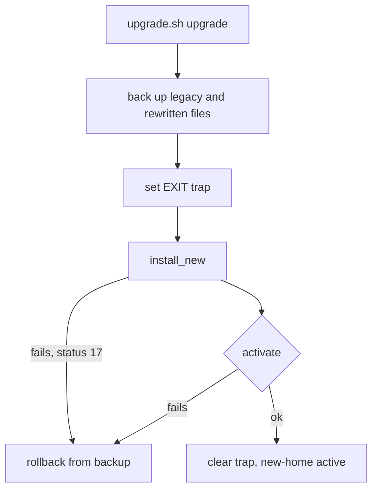

<!-- markdownlint-disable-next-line MD025 -->
# Make the memory engine upgrade roll back completely and signal missing engines

## TL;DR

- Effort: M — one script, one check, one hook change.
- Risk: medium — the upgrade rewrites the owner's hook, helper, and registration.
- Decisions made: back up every file before the first write; edit only the registration's `command`; roll back from an EXIT trap; keep POSIX `sh` with no new dependency.
- Owner decisions pending: none.
- Cut from scope: changing the bank format; a `jq` dependency.
- Branch: `fix/memory-upgrade-rollback` — no branches to sample; type/slug default.

## Scope

### Affected users

The owner, whose session hook (`hook.sh`), shell helper (`helpers.sh`), and tool registration (`tool.json`) call the memory engine.

### Ideal state

A successful upgrade leaves the hook, helper, and registration pointing at `new-home/` with the owner's other registration values intact. Any failure, including one inside installation, and any explicit rollback leave the original installation byte-for-byte and working.

### IS / GAP ledger

| Gap | IS today (evidence) | GAP |
| --- | --- | --- |
| G1 | `upgrade.sh:12-16` — only `legacy/` is backed up; `upgrade.sh:18-31` rewrites `hook.sh`, `helpers.sh`, and `tool.json` | Rewritten files have no backup |
| G2 | `upgrade.sh:18-31` — the registration is replaced with a fixed JSON object; `tool.json:1-6` holds `enabled: false` and a `label` | Unrelated owner values are lost |
| G3 | `upgrade.sh:38-42` — rollback restores only `legacy/`; `hook.sh:3-9` prints `{}` when its engine is missing; `helpers.sh:2-4` names the engine path | After rollback the hook and helper point at a deleted directory |
| G4 | `upgrade.sh:18-31` exits 17 inside the bank copy; `upgrade.sh:44-50` handles only an activation failure | A failure inside installation leaves a partial `new-home/` and no rollback |
| G5 | `hook.sh:3-9` — a missing engine prints `{}` and exits 0 | The host protocol requires a distinct exit status |

### Risks

| Risk | What breaks | Mitigation | Carried by |
| --- | --- | --- | --- |
| A backup taken after a write | Rollback restores rewritten bytes | Back up before `install_new` starts | T1 |
| A trap that masks the exit status | Callers cannot tell a bank failure from an activation failure | Save `$?` first and exit with it | T3 |
| Rollback with no backup | Deletes `legacy/` and the bank with nothing to restore from | `rollback` refuses and changes nothing when `.upgrade-backup/legacy` is absent | T3 |
| A second `upgrade` after success | `backup_state` empties the only backup before finding `legacy/` gone, then a later rollback deletes `new-home/` too, losing the engine and bank entirely | `backup_state` refuses, changing nothing, unless `legacy/bin/memory` exists and `new-home/` does not; the new backup is built in a temporary directory and only swapped in once complete | T1 |
| A signal during installation | An EXIT trap alone does not reliably reflect a caught signal's number in `$?` on every shell, so the rollback can be skipped | Trap `INT`, `TERM`, and `HUP` with their own handlers, each rolling back and exiting a fixed status, alongside the `EXIT` trap | T3 |

### Must have

- MH1: After an explicit rollback or any failed or signal-interrupted upgrade, `hook.sh`, `helpers.sh`, `tool.json`, and `legacy/` equal their pre-upgrade bytes, and the hook reaches the legacy engine.
- MH2: A successful upgrade changes only the registration's `command` value.
- MH3: A failure inside `install_new` rolls back and exits with its own status, 17.
- MH4: One check script exercises the success, rollback, and both failure paths against real entry points.
- MH5: A hook whose engine is missing exits 64, as the host's hook protocol 3.0 requires, so the host offers a repair.
- MH6: A rollback with no usable backup, or an `upgrade` run again after success, changes nothing and exits non-zero; the existing backup is never overwritten until its replacement is complete.

### Must NOT have

- MN1: No new runtime dependency such as `jq` — scope inflation.
- MN2: No change to the bank format or bank contents.

### Coverage

The Evidence index records the files read and the searches for every consumer of the engine path. The bank files are excluded as opaque owner data.

### Critical flows

- FL1: successful upgrade with owner settings present.
- FL2: failure inside installation.
- FL3: explicit rollback after success.

### Baseline

The installation as delivered. `sh upgrade.sh` with no argument prints usage and exits 2. There is no test suite.

### Evidence index

```json
{
  "schemaVersion": 1,
  "citations": [
    {
      "id": "C1",
      "kind": "source",
      "path": "upgrade.sh",
      "startLine": 12,
      "endLine": 16,
      "excerpt": "backup_legacy() {\n  rm -rf \"$BACKUP\"\n  mkdir -p \"$BACKUP\"\n  cp -R \"$ROOT/legacy\" \"$BACKUP/legacy\"\n}",
      "sha256": "bcb2e1cae835cd0148993f21e7ba9d7f55eb806a6128307e3728c8545fa5ea92"
    },
    {
      "id": "C2",
      "kind": "source",
      "path": "upgrade.sh",
      "startLine": 18,
      "endLine": 31,
      "excerpt": "install_new() {\n  mkdir -p \"$ROOT/new-home/bin\" \"$ROOT/new-home/bank\"\n  cp \"$ROOT/legacy/bin/memory\" \"$ROOT/new-home/bin/memory\"\n  for file in \"$ROOT\"/legacy/bank/*; do\n    { step_ok bank-copy && cat \"$file\" > \"$ROOT/new-home/bank/$(basename \"$file\")\"; } || exit 17\n  done\n  sed 's#/legacy/bin/memory#/new-home/bin/memory#' \"$ROOT/hook.sh\" > \"$ROOT/hook.sh.new\"\n  mv \"$ROOT/hook.sh.new\" \"$ROOT/hook.sh\"\n  chmod +x \"$ROOT/hook.sh\"\n  sed 's#/legacy/bin/memory#/new-home/bin/memory#' \"$ROOT/helpers.sh\" > \"$ROOT/helpers.sh.new\"\n  mv \"$ROOT/helpers.sh.new\" \"$ROOT/helpers.sh\"\n  printf '{\\n  \"name\": \"memory\",\\n  \"command\": \"new-home/bin/memory\",\\n  \"enabled\": true\\n}\\n' > \"$ROOT/tool.json\"\n  rm -rf \"$ROOT/legacy\"\n}",
      "sha256": "bcb2e1cae835cd0148993f21e7ba9d7f55eb806a6128307e3728c8545fa5ea92"
    },
    {
      "id": "C3",
      "kind": "source",
      "path": "upgrade.sh",
      "startLine": 38,
      "endLine": 42,
      "excerpt": "rollback() {\n  rm -rf \"$ROOT/new-home\"\n  rm -rf \"$ROOT/legacy\"\n  cp -R \"$BACKUP/legacy\" \"$ROOT/legacy\"\n}",
      "sha256": "bcb2e1cae835cd0148993f21e7ba9d7f55eb806a6128307e3728c8545fa5ea92"
    },
    {
      "id": "C4",
      "kind": "source",
      "path": "upgrade.sh",
      "startLine": 44,
      "endLine": 50,
      "excerpt": "upgrade() {\n  backup_legacy\n  install_new\n  if ! activate; then\n    rollback\n    return 1\n  fi",
      "sha256": "bcb2e1cae835cd0148993f21e7ba9d7f55eb806a6128307e3728c8545fa5ea92"
    },
    {
      "id": "C5",
      "kind": "source",
      "path": "hook.sh",
      "startLine": 3,
      "endLine": 9,
      "excerpt": "here=$(CDPATH= cd -- \"$(dirname -- \"$0\")\" && pwd)\nengine=\"$here/legacy/bin/memory\"\nif [ -x \"$engine\" ]; then\n  exec \"$engine\" \"$@\"\nfi\n# A missing engine is silent: the host receives an empty result.\nprintf '{}\\n'",
      "sha256": "9bd7a74822faf2a95c2096dcebb064b2f3b414132c05f5249e2ccf2f5a17698f"
    },
    {
      "id": "C6",
      "kind": "source",
      "path": "helpers.sh",
      "startLine": 2,
      "endLine": 4,
      "excerpt": "memory_bin() {\n  printf '%s\\n' \"$MEMORY_ROOT/legacy/bin/memory\"\n}",
      "sha256": "8d7cf824bfbf80f1c026f4bb8d80af67446b558a9a6afac36bc695d459071838"
    },
    {
      "id": "C7",
      "kind": "source",
      "path": "tool.json",
      "startLine": 1,
      "endLine": 6,
      "excerpt": "{\n  \"name\": \"memory\",\n  \"command\": \"legacy/bin/memory\",\n  \"enabled\": false,\n  \"label\": \"work profile\"\n}",
      "sha256": "e6d4fb6dfc7bb03092807084c1b43d079f218155292eab0e2c2aca18cdd7381b"
    },
    {
      "id": "C8",
      "kind": "source",
      "path": "legacy/bin/memory",
      "startLine": 1,
      "endLine": 4,
      "excerpt": "#!/bin/sh\n# Memory engine stub. Reports which installation answered the request.\nhome=$(CDPATH= cd -- \"$(dirname -- \"$0\")/..\" && pwd)\nprintf '{\"engine\": \"%s\", \"request\": \"%s\"}\\n' \"$(basename \"$home\")\" \"$*\"",
      "sha256": "b6198fcfe60f372f7727dd1e0b58b4b5474b082a3a71a96b368e15754254df48"
    },
    {
      "id": "C9",
      "kind": "source",
      "path": "upgrade.sh",
      "startLine": 7,
      "endLine": 10,
      "excerpt": "# Test hook: FIXTURE_FAIL=<step> makes that step fail.\nstep_ok() {\n  [ \"${FIXTURE_FAIL:-}\" != \"$1\" ]\n}",
      "sha256": "bcb2e1cae835cd0148993f21e7ba9d7f55eb806a6128307e3728c8545fa5ea92"
    },
    {
      "id": "C10",
      "kind": "source",
      "path": "upgrade.sh",
      "startLine": 33,
      "endLine": 36,
      "excerpt": "activate() {\n  step_ok activate || return 1\n  \"$ROOT/new-home/bin/memory\" ping > /dev/null\n}",
      "sha256": "bcb2e1cae835cd0148993f21e7ba9d7f55eb806a6128307e3728c8545fa5ea92"
    },
    {
      "id": "C11",
      "kind": "self"
    },
    {
      "id": "C12",
      "kind": "planned",
      "path": "tests/check_rollback.sh",
      "createdBy": "T4"
    },
    {
      "id": "C13",
      "kind": "external",
      "url": "https://memory-host.invalid/docs/hook-protocol/3.0",
      "version": "3.0",
      "accessed": "2026-09-28",
      "excerpt": "A hook whose engine is missing MUST exit with status 64 so the host can offer a repair.",
      "obligation": "MH5"
    }
  ],
  "coverage": [
    {
      "id": "V1",
      "paths": [
        "upgrade.sh"
      ],
      "searches": [
        "read upgrade.sh"
      ],
      "producers": [
        "upgrade.sh"
      ],
      "consumers": [
        "hook.sh",
        "helpers.sh",
        "tool.json"
      ],
      "citationIds": [
        "C1",
        "C2",
        "C3",
        "C4",
        "C9",
        "C10"
      ],
      "state": "inspected"
    },
    {
      "id": "V2",
      "paths": [
        "hook.sh",
        "helpers.sh",
        "tool.json",
        "legacy/bin/memory"
      ],
      "searches": [
        "rg -n 'legacy/bin/memory' .",
        "rg -n 'memory' --files"
      ],
      "producers": [
        "upgrade.sh"
      ],
      "consumers": [
        "hook.sh",
        "helpers.sh",
        "tool.json"
      ],
      "citationIds": [
        "C5",
        "C6",
        "C7",
        "C8"
      ],
      "state": "inspected"
    },
    {
      "id": "V3",
      "paths": [
        "legacy/bank/notes.txt",
        "legacy/bank/tasks.txt"
      ],
      "searches": [
        "ls legacy/bank"
      ],
      "producers": [],
      "consumers": [],
      "citationIds": [],
      "state": "excluded",
      "reason": "owner data; copied byte for byte and never parsed"
    }
  ],
  "frontier": [],
  "flows": [
    {
      "id": "FL1",
      "requirementIds": [
        "MH1",
        "MH2"
      ],
      "todoIds": [
        "T1",
        "T2"
      ],
      "evidenceIds": [
        "C1",
        "C2",
        "C7"
      ],
      "entry": "sh upgrade.sh upgrade",
      "startingState": "legacy installation with owner settings in tool.json",
      "effects": [
        "back up legacy/ and the three rewritten files",
        "install new-home",
        "rewrite hook, helper, and the registration command",
        "remove legacy/",
        "activate"
      ],
      "recovery": "EXIT trap runs rollback",
      "counterexample": "tool.json holds enabled false and a label before the upgrade"
    },
    {
      "id": "FL2",
      "requirementIds": [
        "MH3"
      ],
      "todoIds": [
        "T3"
      ],
      "evidenceIds": [
        "C2",
        "C4",
        "C9"
      ],
      "entry": "FIXTURE_FAIL=bank-copy sh upgrade.sh upgrade",
      "startingState": "legacy installation",
      "effects": [
        "back up",
        "partial new-home",
        "bank copy fails with status 17"
      ],
      "recovery": "EXIT trap restores the backup and removes new-home",
      "counterexample": "failure inside install_new before any rewrite"
    },
    {
      "id": "FL3",
      "requirementIds": [
        "MH1"
      ],
      "todoIds": [
        "T3"
      ],
      "evidenceIds": [
        "C3",
        "C5",
        "C6",
        "C7"
      ],
      "entry": "sh upgrade.sh rollback",
      "startingState": "new-home active after a successful upgrade",
      "effects": [
        "remove new-home",
        "restore legacy/",
        "restore hook.sh, helpers.sh, tool.json"
      ],
      "recovery": "backup stays in place for another attempt",
      "counterexample": "hook invoked after rollback"
    }
  ],
  "baseline": {
    "revision": "f4253e0ee997625193ea4ec348407fd40bf39b35",
    "dirty": [
      "docs/plans/2026-09-28-memory-upgrade-hook-protocol.md (untracked: this plan)"
    ],
    "checks": [
      {
        "command": "sh upgrade.sh",
        "exit": 2,
        "result": "prints usage",
        "limitations": "no test suite exists yet"
      }
    ]
  }
}
```

## Research

- Sources: the vendor's hook protocol, `https://memory-host.invalid/docs/hook-protocol/3.0`. The owner quoted its exit-status rule; this plan relies on it for T5.
- How others did it: not applicable.
- What matters: the exit status the host expects from a hook with no engine.
- Pros and cons: exiting 64 lets the host offer a repair; printing `{}` hides the fault.
- What this plan will follow: the quoted 3.0 rule.
- Queries not run: none.

## Questions

### Product

- Who is affected — answer: the owner of this installation.
- What must survive a rollback — answer: every file the upgrade touches, byte for byte.

### Technical

- Add `jq` for the registration edit? — default: no; a `sed` edit of the `"command"` line keeps POSIX `sh`, and the file keeps one key per line.
- Where does failure handling live? — default: an EXIT trap set in `upgrade` before `install_new`.

## Design



## Verification strategy

| Gap | Proof | Expected |
| --- | --- | --- |
| G1 | `sh tests/check_rollback.sh` explicit-rollback case | `cmp` of each rewritten file exits 0 |
| G2 | `sh tests/check_rollback.sh` success case | `tool.json` keeps `enabled: false` and its `label` |
| G3 | `sh tests/check_rollback.sh` rollback case | the hook prints `"engine": "legacy"` |
| G4 | `sh tests/check_rollback.sh` bank-copy failure case | exit 17, no `new-home/`, original bytes |
| G5 | T5 acceptance | exit 64 |

## Execution strategy

Finish T0, then each wave in list order, then the final wave. Do not stop between waves or ask for a continue. If a todo's checks fail, fix that todo and run them again until they pass, then continue.

- T0 runs alone before wave 1.
- Wave 1: T1
- Wave 2: T2 — needs T1, same file
- Wave 3: T3 — needs T2, same file
- Wave 4: T4 — needs T3
- Wave 5: T5 — needs T4

## Todos

Every todo starts with `- [ ] Open`. Run its Acceptance and QA scenario, including the failure case unless it is n/a. After both pass, commit when it says `Commit: yes`, then change its box to `- [x] Done`. Only then start the next todo. This rule does not apply to the final verification wave.

When a wave is done, start the next wave, including the final wave, without asking for a continue. If a todo's checks fail, fix that todo and run them again until they pass, then continue.

### T0 — Copy the plan into the project

- [ ] Open
- Do: if this file is outside the project, copy it into `docs/plans/` under the same name and continue there. If it is already there, keep it.
- Must not: create a second copy or change the plan while copying.
- Closes gap: none.
- Depends on: none.
- References: this file.
- Acceptance: `test -f docs/plans/2026-09-28-memory-upgrade-hook-protocol.md` exits 0.
- QA scenario: happy — the file is already under `docs/plans/` and no copy is made; failure — n/a, the plan ships inside the project.
- Commit: no.

### T1 — Back up every rewritten file before the first write, and never after the first

- [ ] Open
- Do: rename `backup_legacy` to `backup_state`. Before copying anything, refuse and return 1, changing nothing, unless `legacy/bin/memory` exists and `new-home/` does not (`upgrade.sh:12-16`). Remove any existing `.upgrade-backup.tmp/` first — a stale one from an earlier interrupted attempt would otherwise merge with the fresh copy and can silently keep a deleted bank file. Then copy `legacy/`, `hook.sh`, `helpers.sh`, and `tool.json` with `cp -p` into that now-clean `.upgrade-backup.tmp/`, remove any existing `.upgrade-backup/`, and rename the temporary directory into place, so an interrupted copy never leaves a partial backup and a second call never destroys a good one. `upgrade` still calls it before `install_new` (`upgrade.sh:44-50`).
- Must not: take any backup after `install_new` starts, or remove the existing `.upgrade-backup/` before its replacement is fully copied.
- Closes gap: G1.
- Depends on: T0.
- References: `upgrade.sh:12-16`, `upgrade.sh:44-50`.
- Acceptance: `rm -rf /tmp/memory-t1 && cp -R . /tmp/memory-t1 && ROOT=/tmp/memory-t1 sh /tmp/memory-t1/upgrade.sh upgrade && cmp tool.json /tmp/memory-t1/.upgrade-backup/tool.json && cmp hook.sh /tmp/memory-t1/.upgrade-backup/hook.sh && cmp helpers.sh /tmp/memory-t1/.upgrade-backup/helpers.sh && shasum -a 256 /tmp/memory-t1/.upgrade-backup/legacy/bin/memory > /tmp/memory-t1.sha && ! ROOT=/tmp/memory-t1 sh /tmp/memory-t1/upgrade.sh upgrade 2>/dev/null && shasum -a 256 -c --status /tmp/memory-t1.sha` exits 0.
- QA scenario: happy — the three backups equal the originals after a successful upgrade; failure — with `FIXTURE_FAIL=bank-copy`, the backups already exist before the failure, and running `upgrade` again after a success refuses with the first backup byte-identical afterward.
- Commit: no, folds into T3.

### T2 — Change only the registration's command

- [ ] Open
- Do: replace the fixed JSON written by `install_new` (`upgrade.sh:18-31`) with a `sed` edit of the line `"command": "legacy/bin/memory"` to `"command": "new-home/bin/memory"`, written to a temporary file and moved into place.
- Must not: rewrite, reorder, or reformat any other line of `tool.json` (`tool.json:1-6`).
- Closes gap: G2.
- Depends on: T1.
- References: `upgrade.sh:18-31`, `tool.json:1-6`.
- Acceptance: after the T1 command in a fresh copy at `/tmp/memory-t2`, `diff tool.json /tmp/memory-t2/tool.json` shows only the `command` line changed.
- QA scenario: happy — `enabled` stays `false` and `label` stays `work profile`; failure — n/a, the edit has no failure branch of its own; T3 covers failed upgrades.
- Commit: no, folds into T3.

### T3 — Roll back every rewritten file, including after a failure or signal inside installation

- [ ] Open
- Do: make `rollback` (`upgrade.sh:38-42`) refuse and return 1, changing nothing, when `.upgrade-backup/legacy` does not exist; otherwise also restore `hook.sh`, `helpers.sh`, and `tool.json` from `.upgrade-backup/` when present. In `upgrade`, after `backup_state` and before `install_new`, set `trap on_exit EXIT` plus a dedicated handler each for `INT`, `TERM`, and `HUP` that calls `rollback` and exits a fixed status (130, 143, 129) — an `EXIT` trap alone does not reliably see a caught signal's number in `$?` on every shell. Clear all four traps after `activate` succeeds. Change the bank-copy `exit 17` to `return 17` so the traps see status 17 (`upgrade.sh:18-31`, `upgrade.sh:33-36`). Add a `signal_point <name>` test hook beside `step_ok`, called right after the bank copy loop as `signal_point after-bank-copy`: when `FIXTURE_SIGNAL` equals its argument it sends this process `SIGTERM`, deterministically, so T4 does not have to race a real signal against an arbitrary delay.
- Must not: delete `.upgrade-backup/` during rollback, change the exit status of a failed upgrade, or restore anything when no backup exists.
- Closes gap: G3, G4.
- Depends on: T2.
- References: `upgrade.sh:7-10`, `upgrade.sh:18-31`, `upgrade.sh:33-36`, `upgrade.sh:38-42`, `hook.sh:3-9`, `helpers.sh:2-4`.
- Acceptance: in fresh copies under `/tmp/memory-t3-*`, `FIXTURE_FAIL=bank-copy` exits 17 and `FIXTURE_FAIL=activate` exits 1; after each, `diff -r` against the original installation, ignoring `upgrade.sh` and `.upgrade-backup`, reports nothing and `new-home/` is absent. After a successful upgrade then `sh upgrade.sh rollback`, `sh hook.sh ping` prints `"engine": "legacy"`. In a fresh copy with no prior upgrade, `sh upgrade.sh rollback` exits non-zero and `diff -r` reports nothing changed. In a fresh copy, `FIXTURE_SIGNAL=after-bank-copy sh upgrade.sh upgrade` (the test hook sends itself `SIGTERM` right after the bank copy, so the case is exact rather than timing-dependent) exits 143 with `diff -r` reporting nothing changed and `new-home/` absent.
- QA scenario: happy — explicit rollback restores all three files and the hook reaches the legacy engine; failure — a bank-copy failure or the `FIXTURE_SIGNAL=after-bank-copy` case both roll back and exit non-zero, and a rollback with no backup at all refuses instead of deleting the installation.
- Commit: yes — `fix: make the memory upgrade roll back completely` (only `upgrade.sh`).

### T4 — Add a rollback check against the real entry points

- [ ] Open
- Do: add `tests/check_rollback.sh`. It copies the installation (without `tests/`) into a new `mktemp -d` root for each case and runs `upgrade.sh` there with `ROOT` set. Cases: success (hook output names `new-home`; `tool.json` keeps `enabled` and `label`), explicit rollback (hook names `legacy`; `. ./helpers.sh` with `MEMORY_ROOT` set makes `memory_bin` name `legacy/bin/memory`; `cmp` of the three files), `FIXTURE_FAIL=bank-copy` (exit 17, original bytes, no `new-home/`), `FIXTURE_FAIL=activate` (exit 1, original bytes), rollback with no prior upgrade (exits non-zero, original bytes untouched), a second `upgrade` after a success (exits non-zero, the first backup's `legacy/bin/memory` hash unchanged), and `FIXTURE_SIGNAL=after-bank-copy` (exits 143, original bytes, no `new-home/`, no leftover `.upgrade-backup.tmp/`). It prints one line per case and exits 1 on the first mismatch.
- Must not: touch the real installation, or pass when a case fails.
- Closes gap: G1, G2, G3, G4.
- Depends on: T3.
- References: `upgrade.sh:44-50`, `hook.sh:3-9`, `helpers.sh:2-4`, `legacy/bin/memory:1-4`.
- Acceptance: `sh tests/check_rollback.sh` exits 0 and prints seven passing cases.
- QA scenario: happy — all seven cases pass; failure — reverting T3's trap in a scratch copy makes the `FIXTURE_FAIL=bank-copy` and `FIXTURE_SIGNAL=after-bank-copy` cases fail and the script exit 1.
- Commit: yes — `test: check memory upgrade rollback`.

### T5 — Make a hook with no engine exit 64

- [ ] Open
- Do: replace the `printf '{}\n'` fallback in `hook.sh:3-9` with `exit 64`, per the host's hook protocol 3.0 (Evidence index C13).
- Must not: change the hook's output when the engine exists.
- Closes gap: G5.
- Depends on: T4.
- References: `hook.sh:3-9`.
- Acceptance: with the engine removed from a copy at `/tmp/memory-t5`, `sh /tmp/memory-t5/hook.sh ping` exits 64; with it present, the output is unchanged.
- QA scenario: happy — the hook still forwards to the engine; failure — a missing engine exits 64 and prints nothing.
- Commit: yes — `fix: signal a missing engine to the host`.

## Final verification wave

Change a gate's box to `- [x] Done` when that gate is finished. The Todos test-before-next rule does not apply to this wave.

### F1 — Plan compliance

- [ ] Open
- Do: confirm every Must Have with the check's output and every Must NOT Have in the diff.
- Acceptance: each MH has a passing case; no dependency or bank change appears.
- Commit: no.

### F2 — Code quality

- [ ] Open
- Do: run `sh -n upgrade.sh`, `sh -n tests/check_rollback.sh`, and `sh tests/check_rollback.sh`. There is no build or lint command. Check for unused functions and debug output.
- Acceptance: all three exit 0.
- Commit: no.

### F3 — Scenario QA

- [ ] Open
- Do: run every todo's QA scenario in fresh copies.
- Acceptance: each scenario behaves as stated.
- Commit: no.

### F4 — Scope fidelity

- [ ] Open
- Do: compare the diff with T1–T5.
- Acceptance: only `upgrade.sh`, `tests/check_rollback.sh`, and `hook.sh` changed.
- Commit: no.

`ui: no` — shell scripts only.

## Success criteria

| Gap | Closed by | Proof |
| --- | --- | --- |
| G1 | T1, T4 | explicit-rollback case |
| G2 | T2, T4 | success case |
| G3 | T3, T4 | rollback case |
| G4 | T3, T4 | bank-copy failure case |
| G5 | T5 | T5 acceptance |

## Review
