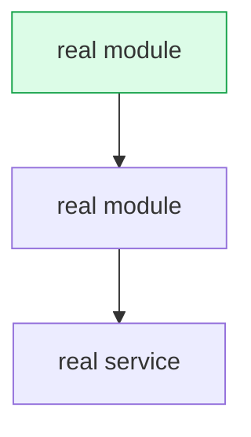

# doc-cleanup

## Purpose

doc-cleanup repairs project documentation in a fixed order: first it proves what the docs claim, then it makes the prose simple, then it draws a picture where a picture is shorter than the prose. The order is the point. A document that reads well and tells you to run a command that no longer exists is worse than the rough draft it replaced, because the clean prose earns trust the content has not earned. So this skill verifies before it rewrites, every time, and it says out loud which claims it could not settle instead of guessing. It serves the reader who is following the docs for the first time.

## When to use / when NOT to use

Use doc-cleanup when you:

- Clean up a `README.md`, a `docs/` tree, a getting-started guide, or a runbook.
- Suspect the docs drifted away from the code after a refactor, a rename, or a dependency bump.
- Inherit a document you did not write and need to know which parts still hold.
- Want documentation rewritten in plainer English without losing any fact.
- Want a flow or an architecture explained with a diagram instead of four paragraphs.

Do NOT use doc-cleanup when you:

- Want new documentation for a feature that has none. This skill repairs text, it does not design a document set.
- Want code, tests, or configuration changed. It edits documentation files only.
- Want `LICENSE`, `NOTICE`, a changelog, release notes, or an attribution footer touched. These are off limits, in every phase.
- Want marketing copy, a launch post, or a landing page. Those need voice, and this skill removes voice.
- Have no repository to check the claims against. Phase 1 needs the real code, not a description of it.

## Workflow

1. List the documentation files in scope. Write the list down. Exclude `LICENSE`, `NOTICE`, `COPYING`, changelogs, release notes, and any file that carries an attribution or legal notice.
2. Read every in-scope file in full before you change anything.
3. Run Phase 1, drift detection, to completion across every file in scope. Record each claim and its verdict.
4. Run Phase 2, simplify, only on text that survived Phase 1.
5. Run Phase 3, diagrams, only after the text is correct and simple.
6. Assemble the report in Output format. Put the claims you could not settle in the "Needs owner confirmation" list.
7. End the report with the before/after summary: word count before, word count after, stale claims fixed, claims flagged.
8. Walk the QA checklist.

The three phases run in this order and never in another: drift, then simplify, then diagrams. Phase 1 is not optional and never moves. Rewrite a stale sentence before you verify it and the error survives in better prose, where it is harder to spot and more likely to be believed. Draw a diagram before you verify and you turn one wrong sentence into a wrong picture, which readers trust more than text.

### Phase 1 — drift detection (always first)

Extract every verifiable claim from the in-scope files. A verifiable claim is anything a reader could execute, open, or check. Pull out each shell command, each CLI flag, each script name, each file and directory path, each environment variable name, each configuration key, each version requirement, and each statement about how the system behaves or is structured.

Check each claim against the repository itself. Never check a claim against another document.

| Claim in the doc | Check it against |
| --- | --- |
| Shell command or script name | The project manifest. `package.json` scripts for a Node or Bun project, and the equivalent for the language in front of you: a `Makefile` target, `pyproject.toml`, `Cargo.toml`, `go.mod`, or `composer.json` |
| CLI flag or subcommand | The tool's own `--help` output when the tool is installed. When it is not installed, the tool's published reference at a stated version |
| File or directory path | The real file tree |
| Environment variable name | The code that reads it, and any example environment file. Check the name only |
| Configuration key or default value | The real configuration file |
| Version or prerequisite | The manifest, and the lockfile when one exists |
| Architecture or behaviour claim | The code that implements it |

Give each claim one of three verdicts:

- **Provably stale.** The evidence contradicts the document. Fix it and record the evidence that proves the fix.
- **Provably correct.** Leave the text alone.
- **Ambiguous.** The evidence does not settle it. Leave the text exactly as it is and add it to the "Needs owner confirmation" list with what you checked and what you found.

Ambiguous is a real verdict, not a failure. A command that a script could plausibly still support, a path that exists under a second name, a behaviour claim that the code neither proves nor disproves: all of these go on the list unchanged. A silent guess that happens to be wrong is the worst output this skill can produce, because it carries the authority of a verified fix.

### Phase 2 — simplify

Rewrite the surviving text in simple English:

- Hold each sentence to a single idea. A sentence carrying two instructions is two sentences that have not been separated yet.
- Name the actor and let that actor act. Stay in the simple tenses, because a compound tense usually buries either who did the thing or when it happened.
- Lead with the circumstance and finish with the instruction. A reader who meets the action first has to go back and re-read it once the qualifier arrives.
- Settle on one term per concept and reuse it for the length of the document. Cycling through check, verify, confirm, and validate reads as variety to the person writing and as four distinct operations to the person reading.
- Strike the words that flatter the software instead of describing it. Powerful, seamless, blazing fast, robust, effortless, and crucial all report the writer's enthusiasm; none of them tell the reader what happens. Give the behaviour or the number, and leave the reader to judge how impressed to be.
- Teach once, then instruct. Explain why a step exists in one or two sentences, then give the steps. Do not repeat the reasoning at every step.
- Simplification may cut words, but it may never cut coverage. If tightening a sentence would strip out a limit, an exception, or the circumstances under which a rule applies, leave the sentence at its full length and record that choice in the report.

Style follows ASD-STE100 Simplified Technical English, Issue 9 (January 2025), published by ASD, the AeroSpace and Defence Industries Association of Europe (asd-ste100.org). ASD-STE100 is the controlled-language standard written for aerospace maintenance documentation and now used well beyond it. The rules above are adapted from that standard's core principles — short sentences, active voice, one instruction per sentence, and a controlled vocabulary; the prose stating them is this file's own.

### Phase 3 — diagrams

Add a Mermaid diagram only where it replaces two or more paragraphs that explain a flow, an architecture, or a process. A diagram that sits next to prose saying the same thing is decoration, and decoration costs the reader time. When no passage meets that bar, add no diagram and say so.

### Diagram rules

- Every node must be a real file, function, module, service, or state that exists in the repository. A node you cannot point at does not belong in the diagram.
- Keep the diagram near 15 to 20 nodes at most. Drop the least important nodes first.
- Add `style` lines to mark what the reader should look at first.
- Choose the type by what you need to show: `flowchart TD` for control flow, `sequenceDiagram` for calls and handshakes over time, `flowchart LR` with `subgraph` for module or service boundaries, `stateDiagram-v2` for lifecycle or status transitions.
- Never add a `click` handler.
- Omit the diagram when the document or the flow is trivial.
- Delete the paragraphs the diagram replaced. A diagram added on top of the prose it duplicates makes the document longer, not clearer.

## Output format

Produce one report alongside the edited files. The five sections run in this order, and section 5 is always last.

````markdown
## Documentation cleanup — <file or document set>

### 1. Drift fixed

| Claim in the doc | Checked against | Verdict | Fix applied |
| --- | --- | --- | --- |
| `<command as the doc printed it>` | `<manifest, help output, or path>` | stale, `<what the evidence shows>` | `<the corrected text>` |

### 2. Needs owner confirmation

1. `<the claim, quoted from the doc>` — what I checked, what I found, and why the evidence does not settle it. Text left unchanged.
2. `<the claim>` — same three parts.

### 3. Simplified

- Sections rewritten: `<section names>`.
- Filler and marketing words removed: `<count>`.
- Kept long on purpose: `<sentence>` — a shorter form would drop `<the limit or exception>`.

### 4. Diagrams



Replaces the `<N>` paragraphs that described `<the flow>`. Keep this section when no diagram met the bar, and replace the block above with one line saying that no passage met the bar.

### 5. Before / after

- Word count: `<before>` -> `<after>`.
- Stale claims fixed: `<N>`.
- Claims flagged for owner confirmation: `<N>`.
- Files edited: `<paths>`.
````

The diagram above shows the shape of the section, not content to reuse. Build every real diagram from the repository in front of you.

## Guardrails

MUST:

- MUST run Phase 1 drift detection first, over every file in scope, and finish it before any rewriting starts. Drift is never phase 2, never phase 3, and never skipped.
- MUST check each claim against the repository: the manifest, the file tree, the tool's `--help` output, the configuration files, or the code.
- MUST record the evidence next to every fix, so a reader can re-run the check.
- MUST leave an ambiguous claim unchanged and list it under "Needs owner confirmation" with what was checked and what was found.
- MUST carry every limit, exception, and condition of applicability through the rewrite. Where that forces a long sentence, report the sentence instead of trimming what it carries.
- MUST add a diagram only where it replaces two or more paragraphs, and delete the paragraphs it replaced.
- MUST keep every diagram node mapped to something real in the repository.
- MUST keep the diagram near 20 nodes or fewer and use `style` lines for emphasis.
- MUST end the report with the before/after summary: word count before and after, the number of stale claims fixed, and the number of claims flagged for owner confirmation.

NEVER:

- NEVER edit `LICENSE`, `NOTICE`, `COPYING`, a legal notice, a changelog, release notes, or an attribution footer. Read them as evidence. Never reword them, never shorten them, never delete them. These carry legal weight that a documentation pass has no standing to change.
- NEVER guess a fix. An unverified change is a new defect wearing the clothes of a correction.
- NEVER change the meaning of a code block. The one exception is a command the evidence proves wrong, and the fix must be the command the evidence supports.
- NEVER rewrite a claim you could not verify. Leave it and flag it.
- NEVER trade away a detail, a precondition, or a warning in exchange for a shorter sentence.
- NEVER invent a module, a service, a file, or a call path for a diagram. An omitted diagram beats a plausible one.
- NEVER add a `click` handler to a diagram.
- NEVER add a decorative diagram.
- NEVER copy documentation text from another project into these files.
- NEVER put a secret, a personal email address, an internal hostname, a local development address, or an absolute path from your own machine into documentation. Name an environment variable by its name only, never its value.
- NEVER edit code, tests, or configuration. This skill changes documentation files only.

## QA checklist

Run this list before you hand the report back.

- [ ] The in-scope file list was written down, and it excludes `LICENSE`, `NOTICE`, changelogs, release notes, and attribution footers.
- [ ] Phase 1 ran first and finished before any sentence was rewritten.
- [ ] Every command, flag, script name, path, environment variable name, and configuration key in the docs was extracted and given a verdict.
- [ ] Every fix names the evidence that proves it.
- [ ] Every ambiguous claim is unchanged in the document and present in the "Needs owner confirmation" list.
- [ ] No claim was changed on a guess.
- [ ] No code block changed meaning, except a command the evidence proved wrong.
- [ ] Nothing the source text established — a limit, an exception, the conditions a rule applies under — went missing in the rewrite.
- [ ] Filler and marketing adjectives are gone, and the reasoning is stated once rather than repeated.
- [ ] Each diagram replaces two or more paragraphs, and those paragraphs were deleted.
- [ ] Every diagram node maps to something real in the repository.
- [ ] No diagram has a `click` handler, and each stays near 20 nodes or fewer.
- [ ] `LICENSE`, `NOTICE`, changelogs, release notes, and attribution footers are byte-identical to before the run.
- [ ] No code, test, or configuration file changed during the run.
- [ ] The documentation contains no secret, no personal data, no internal hostname, and no absolute local path.
- [ ] The report ends with the before/after summary: word count before and after, stale claims fixed, and claims flagged.

<!-- markdownlint-disable-next-line MD034 -->
© Sillybit — https://github.com/Sillybit-io/silly-skills — CC BY-ND 4.0. Attribution required; do not republish modified versions without written approval.
