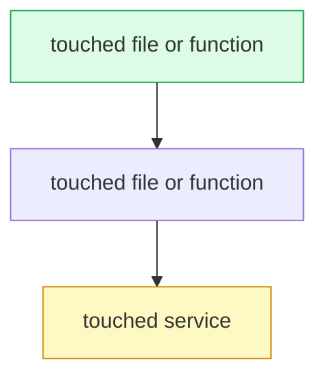

# pr-description

## Purpose

pr-description turns a diff into the part of a pull request description a reviewer actually needs: how far the change reaches, what breaks if it is wrong, whether an AI review is enough, and which files a human has to read line by line. It serves the reviewer first and the author second. It works on an open pull request, on an open merge request, and on a local branch that has no pull request yet. It reads the diff and writes review-guidance text. It never creates a branch, a commit, or a pull request, and it never changes code.

## When to use / when NOT to use

Use pr-description when you:

- Open a pull request or a merge request and need the description body.
- Update a description after you pushed more commits to the branch.
- Want to know, before you open the pull request, how much review the change needs.
- Need to tell reviewers which files to read first and why.
- Need to disclose that an agent wrote part of the change.

Do NOT use pr-description when you:

- Want the code reviewed. This skill describes a change, it does not judge it.
- Want a branch, a commit, or a pull request created. It creates none of them.
- Have no diff yet. Write the code first.
- Want to edit code, tests, or configuration.
- Want to rewrite the human-written parts of an existing description.

## Workflow

1. Get the diff. Use the first tool that is available: `git diff <base>...HEAD` for a local branch, `gh pr diff <number>` for an open GitHub pull request, or `glab mr diff <id>` for an open GitLab merge request.
2. Read the whole diff, not the file list. You need the changed functions, not only the changed paths.
3. Write down every touched path and mark each one new or modified. This list is the only source of truth for the rest of the run.
4. Answer the six classification questions below and record the blast radius verdict: Contained or Critical. Mixed answers resolve to Critical.
5. Size the complexity as S, M, or L with the criteria below.
6. State the risk: the blast radius if this breaks, the worst failure you realistically expect, and the rollback path.
7. Decide whether an AI can review the change: Yes, Partially, or No. Apply the cap rule below.
8. Rank the files a human must review. Put the file that can hurt most first. Give one line of reason per file. Mark every file an agent wrote.
9. Draw the diagram from your step 3 list with the diagram rules below. Skip the diagram for a trivial change.
10. Write the authorship disclosure: the tool and model, the files the agent wrote, and whether a human has read those files line by line.
11. Assemble the seven parts into the block shown in Output format.
12. Place the block. Paste it into a new description. In an existing description, replace only the text between the two marker comments and leave every other line untouched. If the markers are absent, append the block at the end.
13. Walk the QA checklist.

### The six classification questions

Answer all six, then take the verdict.

| # | Question | Leans contained | Leans critical |
| --- | --- | --- | --- |
| a | Propagation range | Few callers | Many callers, or several modules |
| b | Expected change frequency | Stable, rarely edited | Evolving, meant to be extended |
| c | Tech-debt tolerance | Debt stays contained here | Debt blocks other work |
| d | Closest example | Report, endpoint, UI component, script | Auth, payments, schema, public API, shared framework, orchestration |
| e | Failure cost | Regional, easy rollback | System-wide |
| f | Review intensity needed | Interface plus tests is enough | Line-by-line is required |

Mixed answers resolve to Critical. The stricter rule wins because a wrong Contained call costs more than a careful review nobody needed.

The six-question structure is inspired by appleboy/skills' classify-change skill (github.com/appleboy/skills); the Contained/Critical labels are this project's own.

### Complexity criteria

- S — a handful of files, one module, mechanical logic.
- M — many files or two modules, or logic that required a decision.
- L — several modules, or new logic with no precedent in this repository.

Put the file count and the module count next to the letter so a reader can check the call.

### The AI-review cap rule

A Critical verdict caps section 4 at Partially. A change that touches security, payments, or authentication also caps section 4 at Partially, whatever the classification says. Yes is available only for a Contained change that stays clear of those three surfaces. Always give the reason next to the verdict.

### Diagram rules

- Every node must be a file, a function, or a service that appears in the step 3 list. A node you cannot point at in the diff does not belong in the diagram.
- Keep the diagram near 15 to 20 nodes at most. Drop the least important nodes first.
- Add `style` lines so new nodes and modified nodes look different.
- Choose the type by what you need to show: `flowchart TD` for control flow, `sequenceDiagram` for calls and handshakes over time, `flowchart LR` with `subgraph` for module or service boundaries, `stateDiagram-v2` for lifecycle or status transitions.
- Never add a `click` handler.
- Omit the diagram for a trivial change such as a one-line fix.

## Output format

Produce one block with seven numbered sections in this order. The marker comments are part of the output and must stay in the description, because the next run finds its own block by them.

````markdown
<!-- silly-skills:pr-description -->

## Review guidance

### 1. Change classification

**Blast radius: Contained or Critical** — one line on why this verdict.

| Question | Answer | Leans |
| --- | --- | --- |
| Propagation range | callers and modules reached | contained or critical |
| Change frequency | how often this code changes | contained or critical |
| Tech-debt tolerance | who the debt blocks | contained or critical |
| Closest example | report, auth, schema, and so on | contained or critical |
| Failure cost | who feels the failure | contained or critical |
| Review intensity | interface, or line-by-line | contained or critical |

The six-question structure is inspired by appleboy/skills' classify-change skill (github.com/appleboy/skills); the Contained/Critical labels are this project's own.

### 2. Complexity

**S, M, or L** — N files, N modules, mechanical or novel logic.

### 3. Risk

- Blast radius: what stops working when this breaks.
- Worst realistic failure: the failure you actually expect, not the worst imaginable one.
- Rollback: how to undo it, and how long that takes.

### 4. Can AI review this?

**Yes, Partially, or No** — the reason, including the cap rule when it applies.

### 5. Files a human MUST review

1. `path/to/file` — why this one first. Mark it AI-generated when an agent wrote it.
2. `path/to/file` — reason.
3. `path/to/file` — reason.

### 6. Architecture / flow diagram



### 7. AI authorship disclosure

- Tool and model: the agent and model that wrote the code, or none.
- AI-authored files: the paths, or none.
- Human line-by-line review: not done yet, or done and by whom.

<!-- /silly-skills:pr-description -->
````

The diagram above is illustrative. It shows the shape of the section, not content to reuse. Build every real diagram from the files in the diff in front of you, and omit section 6 when the change is trivial.

## Guardrails

MUST:

- MUST build every statement in the block from the diff you actually read.
- MUST mark each path in the step 3 list as new or modified, taken from the diff.
- MUST wrap the output in the two marker comments `<!-- silly-skills:pr-description -->` and `<!-- /silly-skills:pr-description -->`.
- MUST replace only the text between those markers when the description already has them, so a second run produces the same result as the first.
- MUST leave every line outside the markers exactly as its human author wrote it.
- MUST resolve mixed classification answers to Critical.
- MUST cap section 4 at Partially for a Critical change and for any change that touches security, payments, or authentication.
- MUST name the files an agent authored in both section 5 and section 7.
- MUST state plainly when no human has read the AI-written files line by line.
- MUST keep the diagram near 20 nodes or fewer, and drop it for a trivial change.

NEVER:

- NEVER invent a module, a service, a layer, or a call path that the diff does not contain. An empty diagram beats a plausible one.
- NEVER copy the example diagram from this file into a real description.
- NEVER modify code, tests, or configuration. This skill writes review text only.
- NEVER create a branch, a commit, a pull request, or a merge request.
- NEVER push, approve, or merge.
- NEVER delete or rewrite human-written text in a description.
- NEVER add a `click` handler to a diagram.
- NEVER soften the disclosure. When an agent wrote the code, say so.
- NEVER put a secret, a personal email address, an internal hostname, or a customer identifier in a description. Descriptions are often public.

## QA checklist

Run this list before you hand the block back.

- [ ] The diff was read with `git diff <base>...HEAD`, `gh pr diff <number>`, or `glab mr diff <id>`.
- [ ] All seven sections are present, in order, between the two marker comments.
- [ ] The classification verdict follows the six answers, and mixed answers gave Critical.
- [ ] The credit line for the six-question structure is present.
- [ ] Complexity states the file count and the module count.
- [ ] Risk states blast radius, worst realistic failure, and rollback path.
- [ ] Section 4 respects the cap rule for Critical, security, payments, and authentication.
- [ ] Every file in the ranked list has one line of reason, and AI-written files are marked.
- [ ] Every diagram node maps to a path that appears in the diff.
- [ ] The diagram has no `click` handler and stays near 20 nodes or fewer.
- [ ] The diagram is omitted when the change is trivial.
- [ ] The disclosure names the tool, the model, the AI-authored files, and the human review status.
- [ ] A rerun replaced only the marked block and left the rest of the description unchanged.
- [ ] No code, test, or configuration file changed during the run.
- [ ] The description contains no secret, no personal data, and no internal hostname.

<!-- markdownlint-disable-next-line MD034 -->
© Sillybit — https://github.com/Sillybit-io/silly-skills — CC BY-ND 4.0. Attribution required; do not republish modified versions without written approval.
