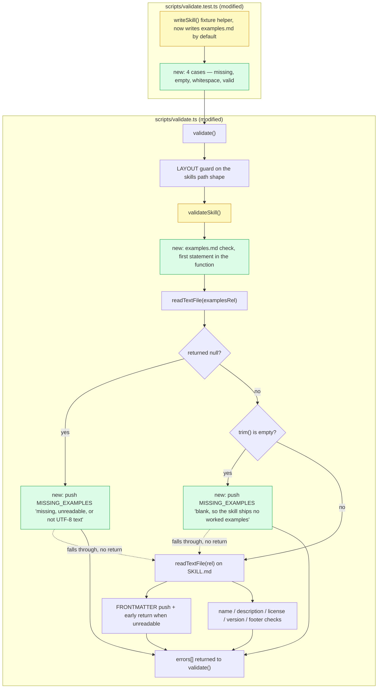

## Prompt

> Write the PR description for this branch. It is one commit, `77335a5`
> (`feat(validate): require a non-blank examples.md for every skill`), sitting on top of `459572f`.
> Claude Code, running Claude Opus, wrote both files. No human has read them line by line yet.

The shared input is the real diff, read with `git show 77335a5`:

```text
 scripts/validate.test.ts | 64 +++++++++++++++++++++++++++++++++++++++++++++++-
 scripts/validate.ts      | 24 ++++++++++++++
 2 files changed, 87 insertions(+), 1 deletion(-)
```

In `scripts/validate.ts` the commit adds a `MISSING_EXAMPLES` error code to the header documentation block
and implements it as the first statement of `validateSkill()`, above the existing
`readTextFile(join(root, rel))` call and its early `return null`. The check calls `readTextFile()` on the
sibling `examples.md`, reports one message when the read returns `null` and a different one when the text
trims to empty, and returns nothing — so control falls through to the `SKILL.md` checks either way. In
`scripts/validate.test.ts` the `Overrides` type gains an `examples` mode, the `writeSkill()` fixture helper
now writes a valid `examples.md` by default, and four cases cover the absent, zero-byte, whitespace-only,
and valid files.

## Without skill

An agent with no skill loaded reads the same diff and writes an accurate, well-organised description. It
summarises the change correctly, lists both files with what each one does, and even carries over the
commit body's point that `bun run validate` now reports nine errors on purpose. Nothing below is wrong.

````markdown
## Summary

This PR adds a new `MISSING_EXAMPLES` validation error to the repository validator. Every skill directory
is now required to ship an `examples.md` file beside its `SKILL.md`, and that file must not be blank —
both zero-byte and whitespace-only files are rejected.

## Changes

- `scripts/validate.ts` — added the `MISSING_EXAMPLES` error code, documented it in the header comment
  block, and implemented the check in `validateSkill()`.
- `scripts/validate.test.ts` — extended the `Overrides` type and the `writeSkill()` fixture helper with an
  `examples` mode, and added four test cases covering absent, zero-byte, whitespace-only, and valid files.

## Testing

`bun test` passes. `bun run validate` now reports 9 errors, because none of the nine shipped skills have an
`examples.md` yet. This is expected: the gate lands before the content.

## Notes

Follow-up work will add the missing `examples.md` files to each skill.
````

What a reviewer cannot get from that description, measured against this skill's output contract:

- No classification verdict, so nothing says whether this is a contained edit or a change to shared
  tooling every skill depends on.
- No complexity sizing, and no file or module count a reader could check the sizing against.
- No risk section: no blast radius, no worst realistic failure, and no rollback path.
- No judgement on whether an AI review is sufficient here.
- The `Changes` list is ordered by path, not by risk, and it does not say which file to open first.
- It describes the check as being "in `validateSkill()`" and never mentions the position above the early
  return — the one decision in the diff that a reviewer has to confirm deliberately.
- It does not flag that `writeSkill()` now writes an `examples.md` by default, which silently changes the
  fixture under every pre-existing test case.
- No diagram, so the fall-through behaviour after a `MISSING_EXAMPLES` push stays invisible.
- No AI authorship disclosure, although the request stated both files were agent-written and unread.
- No marker comments, so a rerun after the next push cannot find its own block and has to guess what to
  replace.

## With skill

Following pr-description against the same diff produces the seven numbered sections between the two
marker comments. Every node in section 6 is a function, a file, or a branch that appears in that diff.

````markdown
<!-- silly-skills:pr-description -->

## Review guidance

### 1. Change classification

**Blast radius: Critical** — five of the six answers lean critical, and this skill resolves mixed answers
to Critical regardless. The change edits the validator that gates every skill in the repository.

| Question | Answer | Leans |
| --- | --- | --- |
| Propagation range | `validateSkill()` has one caller, `validate()`, inside one module (`scripts/`) | contained |
| Change frequency | the validator's rule set is built to be extended; this adds one more error code to a growing list | critical |
| Tech-debt tolerance | the new gate puts `bun run validate` at 9 errors, blocking every other skill commit until eight more `examples.md` files land | critical |
| Closest example | repository validator and CI gate — shared tooling, not a report, endpoint, or UI component | critical |
| Failure cost | a false positive fails the `validate` job for every pull request in the repository | critical |
| Review intensity | the check's position above `validateSkill()`'s early return is the substance of the change, so line-by-line | critical |

The six-question structure is inspired by appleboy/skills' classify-change skill (github.com/appleboy/skills); the Contained/Critical labels are this project's own.

### 2. Complexity

**S** — 2 files, 1 module (`scripts/`), +87/-1. The logic is mechanical: read the file, branch on `null`,
branch on an empty `trim()`, push a `Finding`. One judgement call sits inside it — placing the block above
`validateSkill()`'s early return — which is what pushes the review effort past the size.

### 3. Risk

- Blast radius: `bun run validate` is the repository's CI gate, and `validateSkill()` runs once per skill
  directory, so this check runs nine times per invocation. A false positive fails the `validate` job on
  every pull request until it is reverted. A false negative lets a skill ship with no worked examples.
- Worst realistic failure: not a crash. `readTextFile()` returns `null` for anything it cannot read — a
  path that is not a file, a file over `MAX_SCAN_BYTES`, any thrown read error — and the new block reports
  all of those with the same "missing, unreadable, or not UTF-8 text" message. The failure to expect is a
  misleading `MISSING_EXAMPLES` on an `examples.md` that does exist, sending the author to look for a file
  that is already there.
- Rollback: `git revert 77335a5`. One commit, two files, no migration and no persisted state. The next
  `bun run validate` returns to its previous error count.

### 4. Can AI review this?

**Partially** — the Critical verdict caps this section at Partially. No security, payment, or
authentication surface is touched, so nothing raises the cap further. An AI can check the four new cases
and the `null`-versus-blank branches mechanically. A human has to confirm that the check belongs above the
early return rather than below it, and that collapsing "unreadable" into "missing" is the message the
repository wants.

### 5. Files a human MUST review

1. `scripts/validate.ts` — modified, AI-generated. The new block sits above the
   `readTextFile(join(root, rel))` call and its `return null`; move it below and a skill with an unreadable
   `SKILL.md` silently stops reporting its missing companion file. This file also decides that an absent
   `examples.md` and an unreadable one share one message.
2. `scripts/validate.test.ts` — modified, AI-generated. `writeSkill()` now writes a valid `examples.md`
   unless overridden, which changes the fixture under every pre-existing test case. Confirm that default is
   intended and that the older cases still pass for the reason they used to.

### 6. Architecture / flow diagram



### 7. AI authorship disclosure

- Tool and model: Claude Code, running Claude Opus.
- AI-authored files: `scripts/validate.ts`, `scripts/validate.test.ts`. Both files in the diff.
- Human line-by-line review: not done yet. Section 5 ranks `scripts/validate.ts` first for that read.

<!-- /silly-skills:pr-description -->
````

Three things in that block came from following the skill rather than from reading the diff harder. The
classification table forced the propagation answer to be written down as contained and then overruled, so
the Critical verdict is visibly a decision rather than an impression. The cap rule set section 4 to
Partially before any judgement about the code was made, because Critical caps it. And the diagram was kept
rather than dropped: the skill omits section 6 for a trivial change, and a one-line fix here would have
earned no diagram, but this diff has real branching — two failure messages, and a fall-through to the
`SKILL.md` checks that happens precisely because neither `MISSING_EXAMPLES` push returns. The dotted edges
carry the one behaviour a reviewer would otherwise have to reconstruct by hand.
